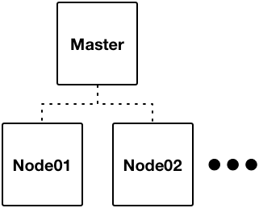

# k8sdc

k8sdc, prounounced Kubernetes DC, aka Kubernetes Data Center, is a project to create an entire data center infrastructure sat atop [Kubernetes](http://kubernetes.io).  This includes all of the software needed for CI/CD, source control, code review, artefact storage, centralised logging and alerting, user registry, mail server, load balancing, blogs, wiki, productivity tools, etc.

The k8sdc platform will be cloud provider agnostic.  It may make use of some cloud provider capabilities, such as external load balancers, but this will be as an alternative to core capabilities.

The intention is to give small / medium businesses and non-profit organisations the ability to stand up an infrastructure that rivals the capabilities of an enterprise at little to no cost and within hours.

There will be simple user guides that describe each of the capabilities and how to use them in combination.  This will allow the development and delivery of applications in a simple, rapid and robust manner, allowing small organisations to deliver digital services to market far more quickly and professionally.

This is a long term project and as such it will take some time to develop.  Especially if the quality is to be kept high.  Initially just the core Kubernetes infrastructure is being delivered.  But this will soon be supplemented with additional capabilities.  Please see the [Roadmap](docs/roadmap.md) for further information.

## Topology

The core k8sdc topology is a simple Kubernetes master plus n x nodes topology.  As can seen below.

As k8sdc grows there will be additional node types that have specialised roles, even though they are still orchestrated by Kubernetes.  Such as for network storage, external load balancers, etc.

All of the k8sdc services will be located in the default Kubernetes namespace.  Application environments can then be created in additonal namespaces.

The Kubernetes networking is configured using Flannel.

## Ansible

Ansible is used to build and configure the k8sdc platform.  Instead of using an OS repository server, the binaries for Kubernetes, Flannel and Etcd are all downloaded directly.  This means that the latest version can be used.

## Quickstart

[Vagrant](docs/vagrant-quickstart.md)

[Cloud](docs/cloud-quickstart.md)